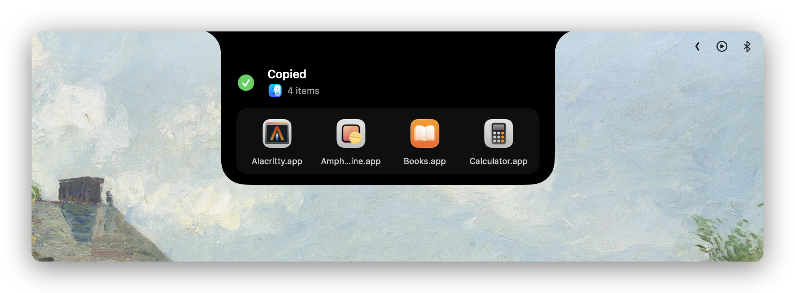
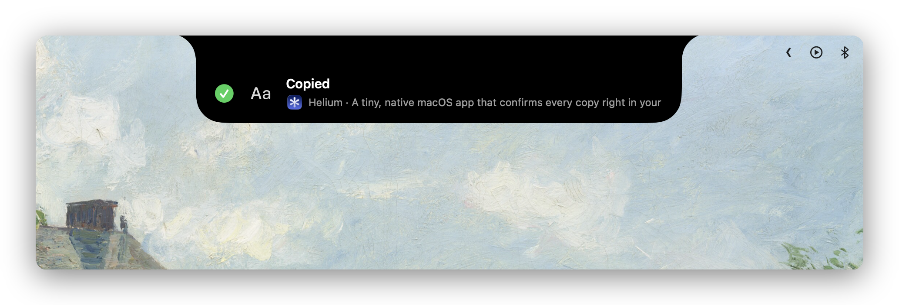
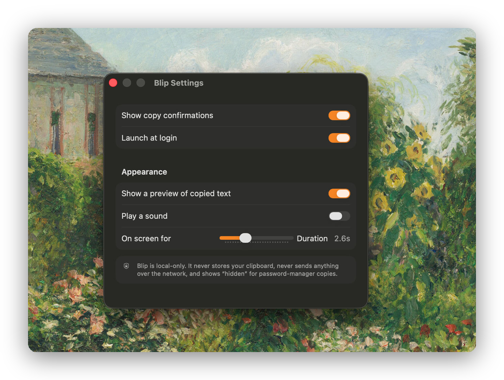

<p align="center">
  
</p>

<h1 align="center">Blip</h1>

<p align="center"><em>Cmd-C, finally with a moment.</em></p>

<p align="center">
  A tiny, native macOS app that confirms every copy right in your notch,
  and tells you <strong>what</strong> you grabbed.
</p>

<p align="center">
  
  
  
  
</p>

---

## Why

You press <kbd>⌘C</kbd> and macOS shows you nothing, so you copy again just in case. Blip gives that moment a beautiful, content-aware confirmation that grows out of the notch and melts back in. No window, no fuss.

It is **not** a clipboard manager. No history, no list, no database. Just a momentary, delightful "got it."

## What it looks like

Blip reads what you copied and shows the right thing:

<p align="center">
  
</p>

- **Text:** a live preview, with word and character counts
- **A color** (`#3DD4FF`): a swatch plus `HEX · rgb(...)`
- **An image:** a real thumbnail with dimensions and size
- **Files:** a side-by-side QuickLook tray (see the file tray above)
- **A link:** the domain, with one-click *Open*
- **A password** (from your password manager): just `hidden`, never the value

Plus the small touches: the app you copied **from**, a **×N** streak when you copy rapidly, and, on **hover**, contextual quick actions (*Open link*, *Reveal in Finder*, *Save image*, *Paste as plain text*, *Copy RGB / HSL*). Click the pill to run the obvious one.

## Settings

Minimal and native: launch at login, on-screen duration, an optional sound, and a text-preview toggle.

<p align="center">
  
</p>

## Private by design

- **100% local. No network, ever.** There is intentionally no network entitlement.
- **No clipboard history or storage.** Each copy is shown, then forgotten.
- Honors the `org.nspasteboard.ConcealedType` flag, so password-manager copies show `hidden`.

## Install

**Download (recommended).** Grab the latest signed and notarized DMG from the [Releases page](https://github.com/IvanKuria/blip/releases/latest), open it, and drag **Blip** into **Applications**. It is notarized by Apple, so it opens with no Gatekeeper warning. Requires macOS 14 or later.

**Build from source** (Xcode 26, macOS 14+):

```bash
brew install xcodegen
git clone https://github.com/IvanKuria/blip.git
cd blip
xcodegen generate
open Blip.xcodeproj      # then press Cmd-R
```

A Homebrew cask lives at [`Casks/blip.rb`](Casks/blip.rb); a tap for `brew install --cask` is on the way.

## How it works

A clean two-layer split:

- **`BlipKit`** is a pure, unit-tested Swift package: a pasteboard abstraction, a content classifier (text, color, image, files, link, concealed), color formatting, and a change watcher. No UI, no network. **21 tests.**
- **`Blip`** is a thin SwiftUI and AppKit menu-bar app that renders the notch pill (`NSPanel`, system materials, SF Pro, SF Symbols, springs), enriches each copy with real previews and the source app, and exposes the hover actions.

The notch silhouette (flush top, concave fillets, rounded bottom) is adapted from [NotchDrop](https://github.com/Lakr233/NotchDrop) (MIT).

## Contributing

Contributions are welcome. See [CONTRIBUTING.md](CONTRIBUTING.md). In short: `swift test` (in `Packages/BlipKit`) must stay green, and UI changes are verified by running the app.

## License

[MIT](LICENSE) © 2026 Ivan Kuria
